# ha-orphaned-entities

[](https://github.com/hacs/integration)
[](https://github.com/Noack1978/ha-orphaned-entities/releases)
[](https://github.com/Noack1978/ha-orphaned-entities/releases/tag/v1.1.0)

Findet verwaiste oder dauerhaft inaktive Entitäten in Home Assistant und ermöglicht es, diese direkt per Lovelace-Karte zu **deaktivieren**, **löschen** oder für zukünftige Scans zu **ignorieren**.

## Features

- 🔍 Erkennt Entitäten ohne Gerät, ohne Integration oder dauerhaft im `unavailable`/`unknown`-Status
- ✅ Checkbox-Auswahl einzelner oder aller Entitäten
- ⏸ Deaktivieren (reversibel, bleibt in der Registry)
- 🗑 Löschen (mit Bestätigungs-Dialog)
- 👁 Ignorieren (wird beim nächsten Scan übersprungen, persistent gespeichert)
- 🔄 Manueller Rescan per Button
- 🔎 Suche & Sortierung nach Domain, Name oder Status
- ⚙️ Konfigurierbar: Scan-Intervall, Inaktivitätsschwelle, ignorierte Domains

### Hinweis zu YAML-Helfern

Per **YAML** (`configuration.yaml`) konfigurierte Helfer wie `template`, `statistics`,
`filter`, `min_max`, `utility_meter`, `history_stats`, `trend`, `threshold`, `tod`,
`generic_hygrostat`/`generic_thermostat`, `derivative`/`integration` (Riemann) und
`bayesian` werden **nicht** als verwaist markiert, auch wenn sie kein Gerät und keinen
Config-Entry besitzen – das ist bei diesen Plattformen normal.

Per **UI** angelegte Helfer (Einstellungen → Geräte & Dienste → Helfer) sind ohnehin
automatisch geschützt, da sie immer einen Config-Entry besitzen.

### Hinweis zu Geräte-Sub-Entitäten

Viele Geräte (z.B. Zigbee-Steckdosen) bieten Sub-Entitäten wie „Child lock" an,
die das jeweilige Gerät nie meldet und die dauerhaft im Status `unknown` bleiben –
das ist normal und kein Zeichen von Verwaisung. Solche Entitäten werden **nur**
als „Inaktiv" markiert, wenn **kein** anderes Entity desselben Geräts innerhalb
der Inaktivitätsschwelle Aktivität zeigt. Ist das Gerät also über andere Entitäten
aktiv, wird die einzelne `unknown`-Sub-Entität nicht angezeigt.

## Installation

### Via HACS (empfohlen)

1. HACS → Integrationen → ⋮ → Benutzerdefiniertes Repository hinzufügen
2. URL: `https://github.com/Noack1978/ha-orphaned-entities`
3. Kategorie: Integration
4. Integration installieren & HA neu starten

### Manuell

Ordner `custom_components/orphaned_entities/` in dein HA-Konfigurationsverzeichnis kopieren.

## Einrichtung

1. Einstellungen → Geräte & Dienste → Integration hinzufügen → **Orphaned Entities**
2. Scan-Intervall, Inaktivitätsschwelle und ignorierte Domains konfigurieren

## Lovelace-Karte

```yaml
type: custom:orphaned-entities-card
```

Die Karte wird nach der Installation der Integration automatisch unter `/orphaned_entities_card/orphaned-entities-card.js` bereitgestellt.

**Lovelace-Ressource manuell hinzufügen** (falls nicht automatisch):

Einstellungen → Dashboards → ⋮ → Ressourcen → `+ Ressource hinzufügen`
- URL: `/orphaned_entities_card/orphaned-entities-card.js`
- Typ: JavaScript-Modul


## Funktionsweise des Scanners

Der Scanner arbeitet in zwei Phasen: zuerst wird per Bulk-Recorder-Abfrage ermittelt
welche Geräte überhaupt aktiv sind, danach wird jede Entität gegen mehrere Kriterien
geprüft (fehlendes Gerät, keine Integration, dauerhaft inaktiv, etc.).

```mermaid
flowchart TD
    Start([Scan gestartet]) --> Pre

    subgraph Pre["Phase 1: Vorab-Analyse"]
        direction TB
        P1["Alle Entitäten durchgehen<br/>(ohne ignorierte Domains/Entitäten)"]
        P2{"Status =<br/>unavailable / unknown?"}
        P3["Zur Liste<br/>'unavailable_entities' hinzufügen"]
        P4["Bulk-Recorder-Abfrage:<br/>Welche dieser Entitäten hatten<br/>einen echten Wert seit Cutoff?"]
        P5["→ active_entity_ids"]
        P6["Geräte ermitteln, die mind.<br/>eine aktive Entität haben"]
        P7["→ active_devices"]

        P1 --> P2
        P2 -- ja --> P3
        P2 -- nein --> P1
        P3 --> P1
        P1 -. fertig .-> P4
        P4 --> P5
        P5 --> P6
        P6 --> P7
    end

    Pre --> Main

    subgraph Main["Phase 2: Hauptprüfung je Entität"]
        direction TB
        M1["Entität auswählen"]
        M2{"device_id gesetzt<br/>aber Gerät fehlt<br/>in Registry?"}
        M3["Reason:<br/>device_missing"]
        M4{"Kein device_id<br/>UND kein platform?"}
        M5["Reason:<br/>no_device_no_platform"]
        M6{"state == None?"}
        M7["Reason:<br/>no_state"]
        M8{"state in<br/>unavailable/unknown<br/>UND last_changed < cutoff?"}
        M9["Reason:<br/>unavailable_Xd"]
        M10{"Kein config_entry_id<br/>UND kein device_id<br/>UND platform NICHT in<br/>YAML_BASED_PLATFORMS<br/>UND domain NICHT in<br/>NO_DEVICE_OK_DOMAINS?"}
        M11["Reason:<br/>no_integration"]
        M12{"Noch KEIN Reason<br/>UND state in<br/>unavailable/unknown?"}
        M13{"hat device_id?"}
        M14{"device_id in<br/>active_devices?"}
        M15{"entity_id in<br/>active_entity_ids?"}
        M16["Reason:<br/>stale_Xd"]
        M17["Keine Reasons<br/>→ Entität ist OK"]
        M18["Reason(s) vorhanden<br/>→ als verwaist anzeigen"]

        M1 --> M2
        M2 -- ja --> M3 --> M6
        M2 -- nein --> M4
        M4 -- ja --> M5 --> M6
        M4 -- nein --> M6

        M6 -- ja --> M7 --> M10
        M6 -- nein --> M8
        M8 -- ja --> M9 --> M10
        M8 -- nein --> M10

        M10 -- ja --> M11 --> M12
        M10 -- nein --> M12

        M12 -- nein --> M19{"Reason(s)<br/>vorhanden?"}
        M12 -- ja --> M13

        M13 -- ja --> M14
        M13 -- nein --> M15

        M14 -- nein --> M16
        M14 -- ja --> M19
        M15 -- nein --> M16
        M15 -- ja --> M19

        M16 --> M19

        M19 -- ja --> M18
        M19 -- nein --> M17
    end

    M17 --> Next([Nächste Entität])
    M18 --> Result([In Ergebnisliste<br/>aufnehmen])

    classDef reason fill:#db4437,color:#fff,stroke:#b71c1c
    classDef ok fill:#4caf50,color:#fff,stroke:#1b5e20
    classDef phase fill:#1565c0,color:#fff,stroke:#0d47a1
    classDef decision fill:#fff3e0,color:#000,stroke:#e65100

    class M3,M5,M7,M9,M11,M16 reason
    class M17,Next ok
    class M18,Result reason
    class P4,P5,P6,P7 phase
    class M2,M4,M6,M8,M10,M12,M13,M14,M15,M19,P2 decision
```



## Services

| Service | Parameter | Beschreibung |
|---|---|---|
| `orphaned_entities.rescan` | – | Neustart des Scans |
| `orphaned_entities.get_results` | – | Ergebnisse abrufen (feuert Event) |
| `orphaned_entities.disable_entity` | `entity_id` | Entität deaktivieren |
| `orphaned_entities.delete_entity` | `entity_id` | Entität löschen |
| `orphaned_entities.ignore_entity` | `entity_id` | Entität ignorieren |
| `orphaned_entities.unignore_entity` | `entity_id` | Ignorierung aufheben |

## Einstellungen

| Parameter | Standard | Beschreibung |
|---|---|---|
| Scan-Intervall | 24 Stunden | Wie oft automatisch gescannt wird |
| Inaktivitätsschwelle | 30 Tage | Ab wann `unavailable`/`unknown` als verwaist gilt |
| Ignorierte Domains | (viele) | Diese Domains werden beim Scan übersprungen |
